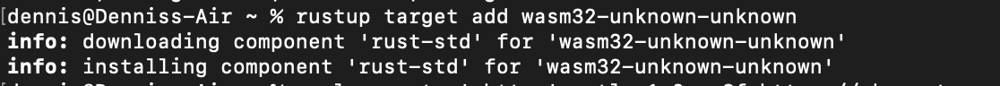
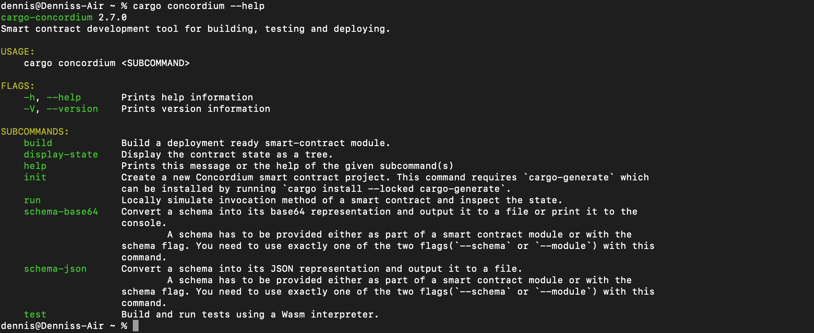
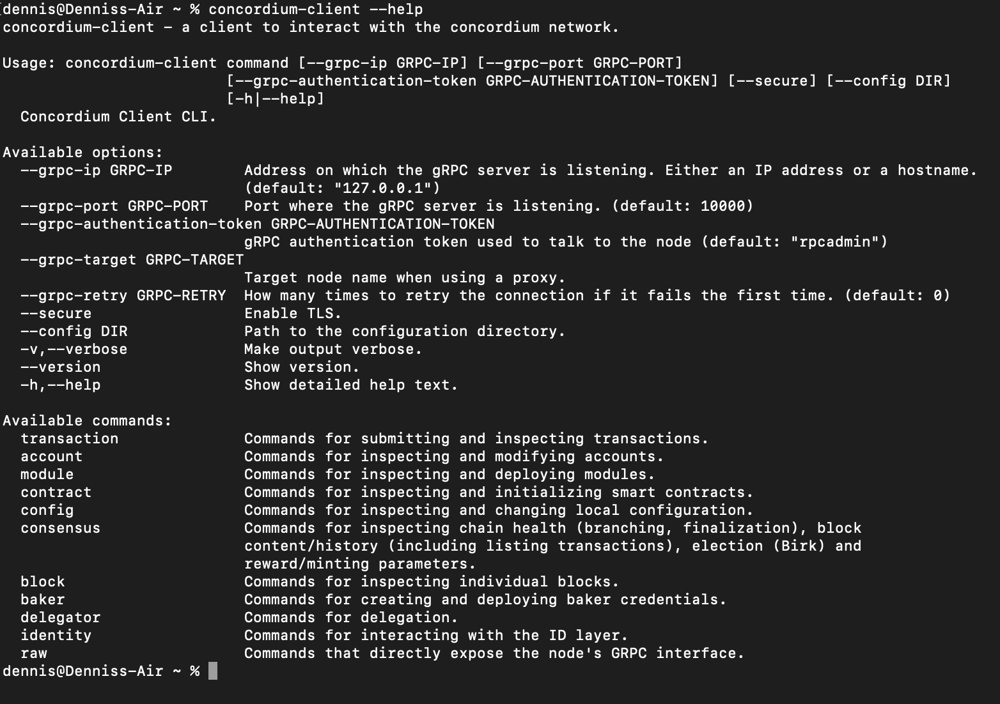
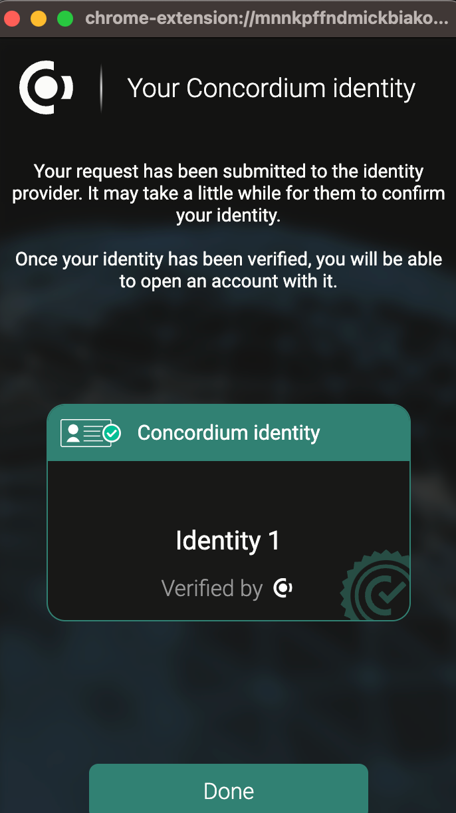
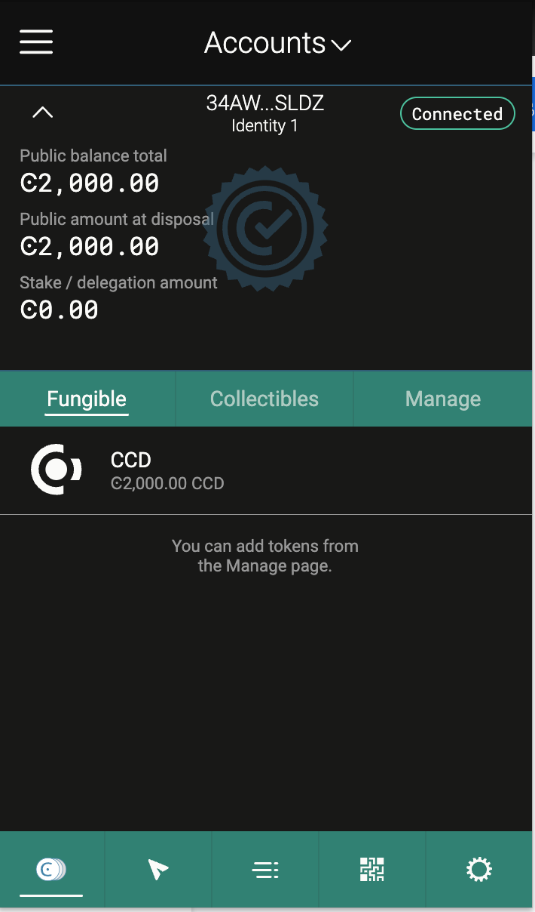
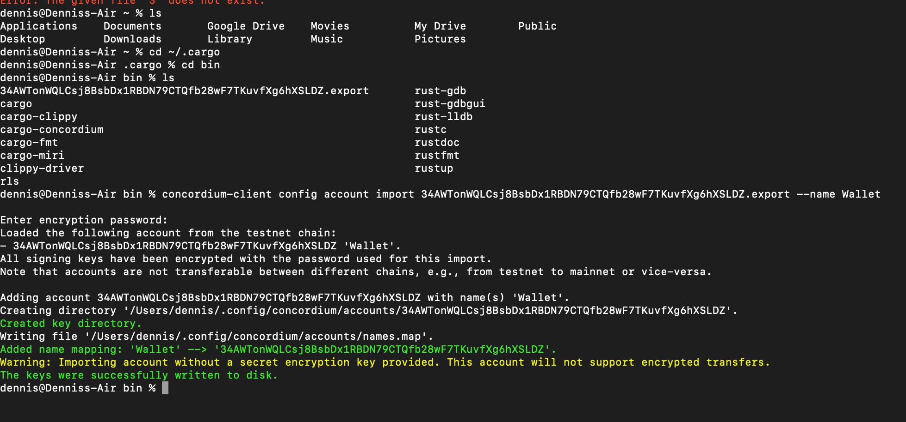

# Concordium-Hackathon
----------------------------
# Mainnet Wallet address: 3WcYjYVbvBYRzrr5UVM8yVpzLMRvyac3aENJ3tw7K7bdNjBLSZ

# Testnet Wallet Address: 34AWTonWQLCsj8BsbDx1RBDN79CTQfb28wF7TKuvfXg6hXSLDZ
----------------------------
## Step 1- Install Rust
```
    curl --proto '=https' --tlsv1.2 -sSf https://sh.rustup.rs | sh
```
 

```
rustup target add wasm32-unknown-unknown
```


## Step 2- Install Concordium Software
proof:


## Step 3- Install Concordium client


## Step 4- Create a new account/Set up wallet

 

## Step 5- Export Keys
